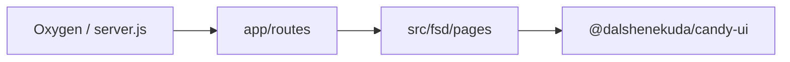

# CandyArea

**Hydrogen storefront demo** powered by the [CandyUI](https://github.com/dalshenekuda/CandyUI) design system — a portfolio case study for headless Shopify commerce, not a production store.

| Link | URL |
| --- | --- |
| **Live demo** | `[TBD]` — deploy to Shopify Oxygen (see [Deploy](#deploy-to-shopify-oxygen)) |
| **CandyUI (GitHub)** | https://github.com/dalshenekuda/CandyUI |
| **CandyUI (npm)** | [`@dalshenekuda/candy-ui`](https://www.npmjs.com/package/@dalshenekuda/candy-ui) |
| **Storybook** | [main--6ab56ef1aed13efbc107d427.chromatic.com](https://main--6ab56ef1aed13efbc107d427.chromatic.com/) |
| **This repo** | https://github.com/dalshenekuda/CandyArea |

CandyArea **consumes** CandyUI from npm. To iterate on unreleased CandyUI changes locally without committing a `file:` dependency, build CandyUI and `npm link` it into this project (see [CandyUI's README](https://github.com/dalshenekuda/CandyUI#local-install-in-another-project)); switch back to the npm range before pushing.

---

## Stack

- [Shopify Hydrogen](https://shopify.dev/docs/storefronts/headless/hydrogen) `2026.1.1`
- [React Router](https://reactrouter.com/) `7.12` (Hydrogen skeleton, not Remix)
- Vite 6, Tailwind CSS + `@dalshenekuda/candy-ui/tailwind.preset`
- Feature-Sliced Design pages under [`src/fsd/pages`](src/fsd/pages)
- Oxygen worker entry: [`server.js`](server.js)

## Architecture



- **Routes** — file-based routing via [`app/routes.js`](app/routes.js) and [`app/routes/`](app/routes/).
- **UI** — route modules delegate to FSD page components; shared chrome in [`app/components`](app/components).
- **Design system** — global CandyUI styles in [`app/root.jsx`](app/root.jsx); Tailwind preset in [`tailwind.config.js`](tailwind.config.js).

## Features (implemented routes)

| Area | Routes |
| --- | --- |
| Home | `/` |
| Collections | `/collections`, `/collections/all`, `/collections/:handle` |
| Product (PDP) | `/products/:handle` |
| Cart | `/cart`, `/cart/:lines` |
| Search | `/search` |
| Content | `/blogs`, `/blogs/:blog`, `/pages/:handle`, `/policies` |
| Account | `/account`, profile, addresses, orders (requires Customer Account setup) |
| SEO / utilities | sitemap, robots, discount codes, Storefront API proxy |

---

## Local development

**Requirements:** Node.js `^22 || ^24` (see [`package.json`](package.json) `engines`).

```bash
npm install
cp .env.example .env   # set SESSION_SECRET at minimum
npm run dev
```

Other scripts:

```bash
npm run build    # shopify hydrogen build --codegen
npm run preview  # production preview locally
npm run lint
```

**Developing against unreleased CandyUI changes:** this repo depends on `@dalshenekuda/candy-ui` from npm. To try changes from a local CandyUI checkout before they're published, run `npm run build && npm link` in `../CandyUI`, then `npm link @dalshenekuda/candy-ui` here — `npm install` (or a fresh clone) reverts to the published version.

### Mock shop vs linked store

- **Mock / demo:** Hydrogen serves [Mock.shop](https://mock.shop/) catalog when no store domain is configured. The home page shows a [`MockShopNotice`](app/components/MockShopNotice.jsx) banner explaining the demo catalog.
- **Linked store:** Connect your Shopify development store (credentials stay local — never commit `.env` or `shopify.app.toml`):

```bash
npx shopify hydrogen link
npx shopify hydrogen env pull
```

When `PUBLIC_STORE_DOMAIN` is set, the mock notice is hidden and live storefront data is used.

### Environment variables

Copy [`.env.example`](.env.example). Names only (no secrets in git):

| Variable | Mock demo | Linked store |
| --- | --- | --- |
| `SESSION_SECRET` | Required | Required |
| `PUBLIC_STORE_DOMAIN` | Optional | Required |
| `PUBLIC_STOREFRONT_API_TOKEN` | Optional | Required |
| `PUBLIC_STOREFRONT_ID` | Optional | Required |
| `PUBLIC_CHECKOUT_DOMAIN` | Optional | Required |
| `PUBLIC_CUSTOMER_ACCOUNT_API_*` | Optional | Required for `/account` |

---

## Deploy to Shopify Oxygen

Public URL for LinkedIn / portfolio: **`[TBD]`** — replace after deploy.

1. Install [Shopify CLI](https://shopify.dev/docs/api/shopify-cli) and log in.
2. Link the project: `npx shopify hydrogen link`
3. Sync env vars to Oxygen: `npx shopify hydrogen env pull` (and configure secrets in the Shopify admin for production).
4. Deploy: `npx shopify hydrogen deploy` ([Hydrogen deployments](https://shopify.dev/docs/storefronts/headless/hydrogen/deployments)).
5. Paste the Oxygen preview or production URL above in this README.

The demo can stay on **mock catalog + notice**; no private store credentials need to be in the repo. Confirm `@dalshenekuda/candy-ui/style.css` loads on production (no 404 on CSS assets).

---

## GitHub Actions (CI)

Workflow: [`.github/workflows/ci.yml`](.github/workflows/ci.yml) — `npm ci`, `npm run lint`, `npm run build`.

For `build` on GitHub, set **Repository secrets** (Settings → Secrets and variables → Actions):

| Secret | Purpose |
| --- | --- |
| `SESSION_SECRET` | Dummy or real session secret for Hydrogen build/runtime checks |

Optional (only if you want CI against a real storefront):

| Secret | Purpose |
| --- | --- |
| `PUBLIC_STORE_DOMAIN` | Linked store domain |
| `PUBLIC_STOREFRONT_API_TOKEN` | Storefront API token |
| `PUBLIC_STOREFRONT_ID` | Storefront ID |
| `PUBLIC_CHECKOUT_DOMAIN` | Checkout domain |

For Oxygen deploy from CI, use Shopify’s [deployment token](https://shopify.dev/docs/storefronts/headless/hydrogen/deployments/custom-ci-cd) as `SHOPIFY_HYDROGEN_DEPLOYMENT_TOKEN` (not stored in this repo).

---

## Screenshots (optional)

Add portfolio captures under `docs/images/` (homepage, collection, cart) when available — paths can be linked from this README without committing large binaries if you prefer external hosting.

---

## License / intent

Private npm package scope `@dalshenekuda/*`; this repository is a **portfolio demo** (`private: true`), based on the official Hydrogen skeleton.
